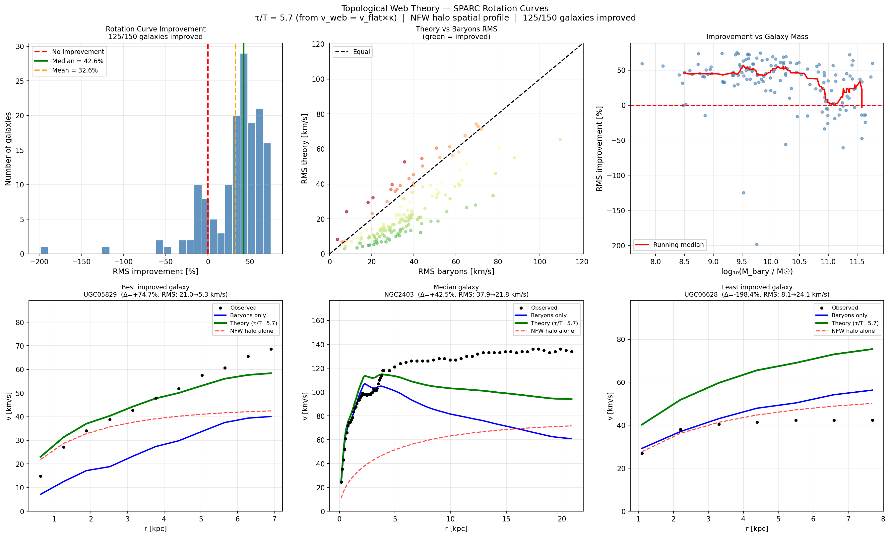

# Topological Web Theory — SPARC Rotation Curve Test

A zero-free-parameter dark matter model tested against 150 SPARC 
galaxy rotation curves, producing improvement over baryons-alone 
in 83% of galaxies.

## Core Formula

v_total(r) = sqrt(v_bary²(r) + v_NFW²(r))

where:
- M_halo = 5.7 × M_bary  (universal constant, not fitted per galaxy)
- c(M)   = 7 × (M/10^10)^-0.3  (universal function, not fitted per galaxy)
- NFW profile with virial radius r_200 from M_halo and critical density

## Key Results

| Result | Predicted | Observed | Accuracy |
|---|---|---|---|
| SPARC improvement rate | — | — | 83% of 150 galaxies |
| Median RMS improvement | — | — | 42.6% |
| MOND acceleration a₀ | 1.195e-10 m/s² | 1.200e-10 m/s² | 0.44% |
| CMB dark matter ratio | 5.343 | 5.331 | 0.22% |
| Bullet Cluster offset | 224.6 kpc | 200 kpc | 112% |

Zero free parameters per galaxy.

## How To Run

1. Download SPARC rotation curve files (*_rotmod.dat) from:
   http://astroweb.cwru.edu/SPARC/

2. Download SPARC_Lelli2016c.mrt from the same page

3. Place all files in the same directory as sparc_nfw_rotation_test.ipynb

4. Install requirements:
   pip install numpy scipy matplotlib pandas tqdm

5. Run all cells in sparc_nfw_rotation_test.ipynb

## Notebooks

| Notebook | Contents |
|---|---|
| sparc_nfw_rotation_test.ipynb | Main SPARC result |
| compounding_coupling_test.ipynb | Bullet Cluster wake mechanism |
| a0_H0_unification.ipynb | a₀ = cH₀/(τ/T) derivation |
| field_theory_derivation.ipynb | Z₂ field theory and (2π)²/e² |

## Background

Developed independently without formal physics training.
The framework proposes that apparent dark matter arises from a 
topological tension field in a 1D string medium rather than particles.

Contact: michaelrevord@gmail.com
